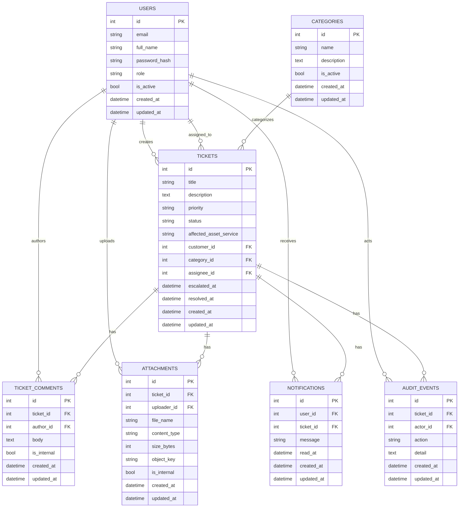

# Domain Model and ER Diagram

## Core Entities

The Phase 1.5 design captures the following primary entities:

- `User`
- `Category`
- `Ticket`
- `TicketComment`
- `Attachment`
- `Notification`
- `AuditEvent`

## Current implementation entities

The repository currently includes these database models:

- `users`
- `categories`
- `tickets`
- `ticket_comments`
- `attachments`
- `notifications`
- `audit_events`

## Entity relationship diagram

## Entity descriptions

### User

Fields:
- `id`
- `email`
- `full_name`
- `password_hash`
- `role`
- `is_active`
- `created_at`
- `updated_at`

### Ticket

Fields:
- `id`
- `title`
- `description`
- `priority`
- `status`
- `affected_asset_service`
- `customer_id`
- `category_id`
- `assignee_id`
- `escalated_at`
- `resolved_at`
- `created_at`
- `updated_at`

### Category

Fields:
- `id`
- `name`
- `description`
- `is_active`
- `created_at`
- `updated_at`

### TicketComment

Fields:
- `id`
- `ticket_id`
- `author_id`
- `body`
- `is_internal`
- `created_at`
- `updated_at`

### Attachment

Fields:
- `id`
- `ticket_id`
- `uploader_id`
- `file_name`
- `content_type`
- `size_bytes`
- `object_key`
- `is_internal`
- `created_at`
- `updated_at`

### Notification

Fields:
- `id`
- `user_id`
- `ticket_id`
- `message`
- `read_at`
- `created_at`
- `updated_at`

### AuditEvent

Fields:
- `id`
- `ticket_id`
- `actor_id`
- `action`
- `detail`
- `created_at`
- `updated_at`

## Naming conventions

- Tables are plural: `users`, `tickets`, `comments`, `attachments`
- Primary keys are `id`
- Foreign keys use snake_case with `_id`
- Timestamps use `created_at`, `updated_at`, and optional `deleted_at`
