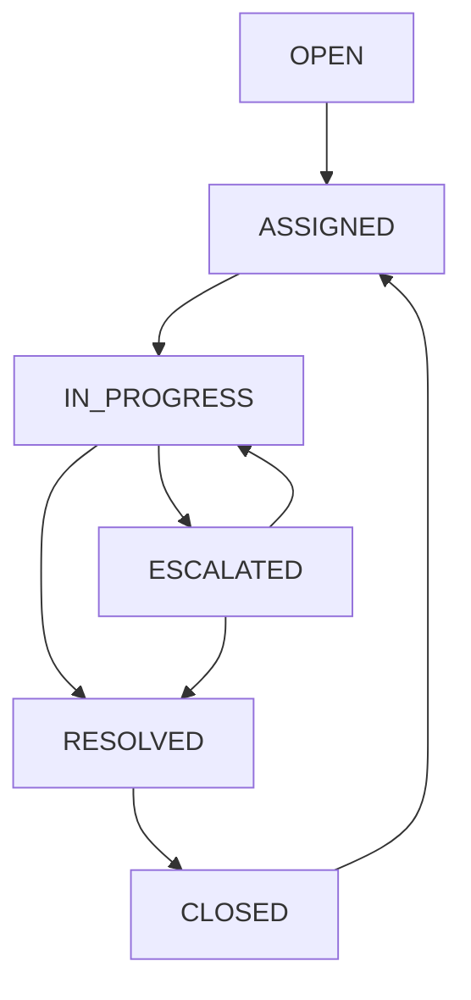

# Ticket Lifecycle

## State machine

The ticket lifecycle is modeled as a finite state machine rather than free-text status values.

### States

- `OPEN`
- `ASSIGNED`
- `IN_PROGRESS`
- `ESCALATED`
- `RESOLVED`
- `CLOSED`

### Allowed transitions

### Transition rules

- `OPEN` → `ASSIGNED`
- `ASSIGNED` → `IN_PROGRESS`
- `IN_PROGRESS` → `ESCALATED` or `RESOLVED`
- `ESCALATED` → `IN_PROGRESS` or `RESOLVED`
- `RESOLVED` → `CLOSED`
- `CLOSED` → `ASSIGNED` via reopen

## Current implementation

The backend currently enforces ticket status transitions in `app/api/v1/tickets.py` using the allowed transition map in `app/domain.py`.

- Customers create tickets in `OPEN`
- Tier 1 can assign and escalate tickets
- Tier 2 can receive escalated tickets and resolve them
- Both Tier 1 and Tier 2 can resolve tickets
- A resolved ticket can be closed
- Closed tickets can be reopened back into assigned state

## Notes

- The state machine should remain the single source of truth for valid status transitions.
- Future phases can add additional intermediate states like `PENDING` or `ON_HOLD`.
